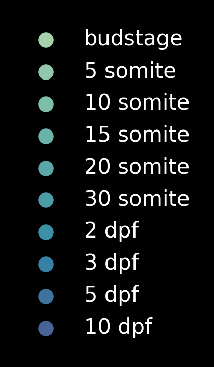

# zebra_3DUMAP
Generate 3D UMAPs of zebra fish

## Installation

```bash
conda create -n napari3drot python=3.9
conda activate napari3drot
pip install -r requirements.txt
```

If you are on a M1 Mac, you should try instead the `setup_env.sh` script.


## Generate a rotating 3D UMAP animation with all timepoints annotation

### Load data
```python
import pandas as pd

df_umap = pd.read_csv('umap_coords.csv')
df_meta = pd.read_csv('meta_data_timepoint.csv')
df_global_annotation = pd.read_csv('meta_data_globalannotation.csv')

```

### Prepare labels with a designated colormap
```python
import seaborn as sns
import colorcet as cc
from natsort import natsorted
import numpy as np

colormap_name = 'crest'
df_meta_time = df_meta.groupby('timepoint')
uniq_time = natsorted(df_meta.timepoint.unique())
uniq_time = uniq_time[:1] + [t for t in uniq_time if 'somite' in t] + [t for t in uniq_time if 'dpf' in t]
if colormap_name == 'isolum':
    cmap = sns.color_palette(cc.isolum, 256)[::25][::-1]
else:
    cmap = sns.color_palette(colormap_name, len(uniq_time))
    cmap = [tuple((i ** 0.7)) for i in np.array(cmap)]

lab_color = np.zeros((len(df_umap), 4))
for i0, tp in enumerate(uniq_time):
    ind = df_meta_time.get_group(tp)
    lab_color[ind.index] = np.array(cmap[i0] + (1,)).reshape(1, -1)

```

### Show a 3D UMAP in napari
```python
import napari

viewer = napari.view_points(
    df_umap[['UMAP1', 'UMAP2', 'UMAP3']],
    scale=(100,) * 3,
    shading='none',
    size=0.06,
    name='umap3d',
    edge_width=0,
    face_color=lab_color,
    ndisplay=3,
)
viewer.window.resize(1000 + 300, 1000)

```

### Shoot a rotating UMAP movie
In the following code snippet, the UMAP rotates for 360 + 60 degrees. 
The additional 60 deg is to get a smooth transision with a successive video clip.
Comment the 2 lines out if a 360-degree rotation is desired.

```python
import os
from os.path import join, exists
from napari_animation import Animation

# Set shooting parameters
div = 3
scale_factor = 1  # scale factor for the final output video size
fps = 60  # frames per second for the final output video
nb_steps = fps * div  # number of steps between two target angles
# Define a save path
savepath = join('output', 'by_fish_timepoint', colormap_name + '_flat')
if not exists(savepath):
    os.makedirs(savepath)
    

# Instantiates a napari animation object for our viewer:
animation = Animation(viewer)

# Ensures we are in 3D view mode:
viewer.dims.ndisplay = 3
# resets the camera view:
viewer.reset_view()

# Start recording key frames after changing viewer state:
viewer.camera.angles = (0.0, 0.0, 90.0)
animation.capture_keyframe(steps=nb_steps)
viewer.camera.angles = (0.0, 180.0, 90.0)
animation.capture_keyframe(steps=nb_steps)
viewer.camera.angles = (0.0, 360.0, 90.0)
animation.capture_keyframe(steps=nb_steps)
# Additional 60 deg for smooth transition with a successive video clip.
# Comment the following 2 lines out if 360-degree rotation is desired.
viewer.camera.angles = (0.0, 60.0, 90.0)
animation.capture_keyframe(steps=nb_steps // 3)

# Render animation as a GIF:
animation.animate(
    join(savepath, f'rot3DUMAP_alltp.gif'),
    canvas_only=True,
    fps=fps,
    scale_factor=scale_factor
)

```

Resulting GIF of rotating UMAP.


### Generate a legend
```python
import matplotlib.pyplot as plt
import string

plt.style.use('dark_background')
fig, ax = plt.subplots(1)
legendFig = plt.figure(figsize=(1.4, 2.4))
plist = []
leg_names = []
alphabets, digits = string.ascii_lowercase, string.digits
for i, n in enumerate(uniq_time):
    num = n.rstrip(alphabets).rstrip()
    if num[0] == '0':
        num = num[1:]
    nam = n.strip(digits).strip()
    if num == '':
        n = nam
    else:
        n = ' '.join([num, nam])

    plist.append(
        ax.scatter(i, i, c=np.array(cmap[i] + (1,)).reshape(1, -1), s=40, label=n)
    )
    leg_names.append(n)
legendFig.legend(plist, leg_names, loc='center', frameon=False)
legendFig.savefig(join(savepath, 'legend_alltp.png'), dpi=300)
legendFig.savefig(join(savepath, 'legend_alltp_transparent.png'), dpi=300, transparent=True)

```

Resulting PNG of a legend.




## Pre-generated movies
can be found through the following link
https://drive.google.com/drive/folders/1Y3R_UTfPXhyF75wz08AHwvzI3kJHpnfB?usp=sharing
